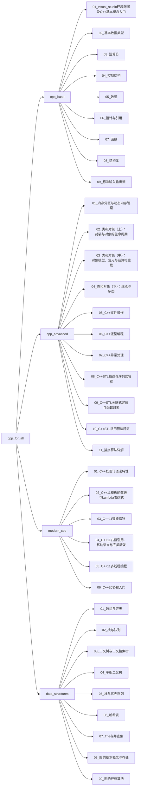

# cpp_for_all

本人的 C++ 学习笔记知识库，覆盖 C++ 基础、C++ 进阶、现代 C++ 与数据结构四大系列，持续更新中。

```mermaid
graph LR
    root["cpp_for_all"]

    root --> base["cpp_base"]
    root --> adv["cpp_advanced"]
    root --> modern["modern_cpp"]
    root --> ds["data_structures"]

    base --> b01["01_visual_studio环境配置<br/>及C++基本概念入门"]
    base --> b02["02_基本数据类型"]
    base --> b03["03_运算符"]
    base --> b04["04_控制结构"]
    base --> b05["05_数组"]
    base --> b06["06_指针与引用"]
    base --> b07["07_函数"]
    base --> b08["08_结构体"]
    base --> b09["09_标准输入输出流"]

    adv --> a01["01_内存分区与动态内存管理"]
    adv --> a02["02_类和对象（上）：<br/>封装与对象的生命周期"]
    adv --> a03["03_类和对象（中）：<br/>对象模型、友元与运算符重载"]
    adv --> a04["04_类和对象（下）：继承与多态"]
    adv --> a05["05_C++文件操作"]
    adv --> a06["06_C++泛型编程"]
    adv --> a07["07_C++异常处理"]
    adv --> a08["08_C++STL概述与序列式容器"]
    adv --> a09["09_C++STL关联式容器<br/>与函数对象"]
    adv --> a10["10_C++STL常用算法精讲"]
    adv --> a11["11_排序算法详解"]

    modern --> m01["01_C++11现代语法特性"]
    modern --> m02["02_C++11模板的改进<br/>与Lambda表达式"]
    modern --> m03["03_C++11智能指针"]
    modern --> m04["04_C++11右值引用、<br/>移动语义与完美转发"]
    modern --> m05["05_C++11多线程编程"]
    modern --> m06["06_C++20协程入门"]

    ds --> d01["01_数组与链表"]
    ds --> d02["02_栈与队列"]
    ds --> d03["03_二叉树与二叉搜索树"]
    ds --> d04["04_平衡二叉树"]
    ds --> d05["05_堆与优先队列"]
    ds --> d06["06_哈希表"]
    ds --> d07["07_Trie与并查集"]
    ds --> d08["08_图的基本概念与存储"]
    ds --> d09["09_图的经典算法"]
```
