# 01_visual_studio环境配置及C++基本概念入门

## 1. 下载visual studio

* 打开visual studio官网链接：[visual studio官方网站](https://visualstudio.microsoft.com/)
* 点击下载visual studio：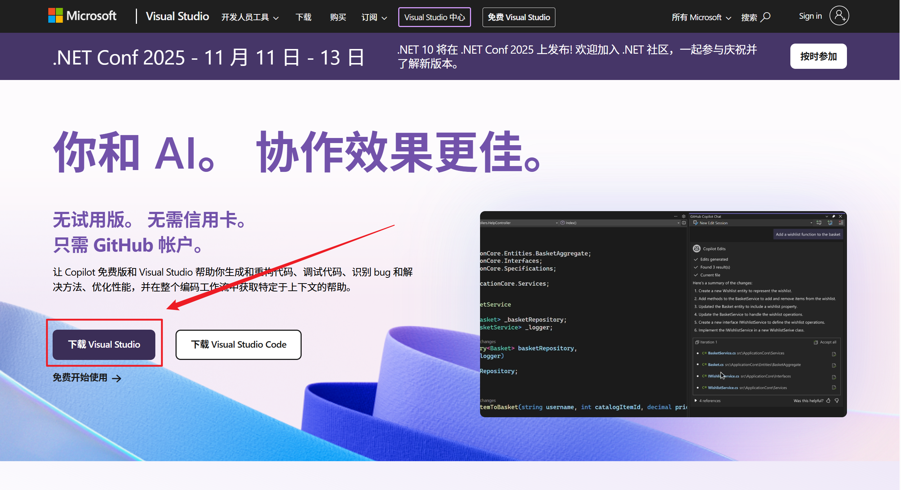
* 跳转此页面后，就已经开始下载了，如果未开始下载，可以手动点一下提示的位置: 
* 下载的是visual studio installer。

## 2. 安装visual studio

* 把上一节下载的visual studio installer双击运行起来，勾选使用C++的桌面开发: 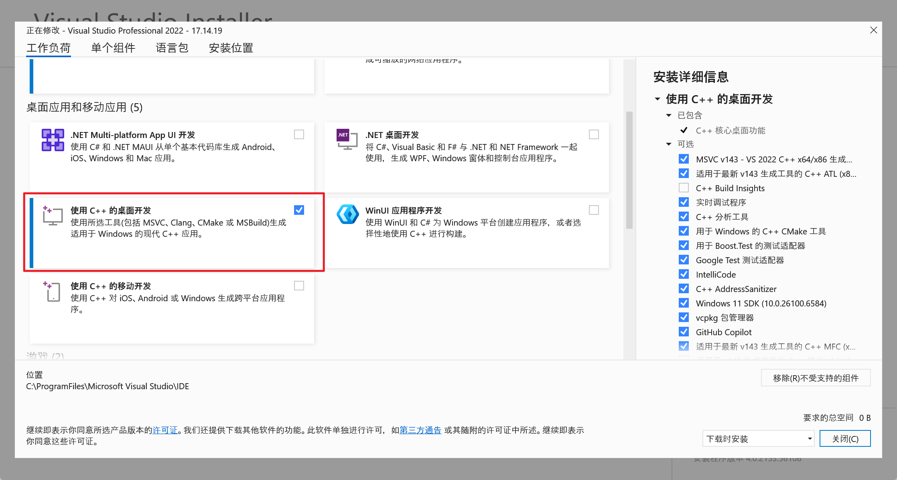
* 安装位置可以改也可以不改，以下是本人对于软件安装目录的一些看法，仅供参考：

  * 无法脱离操作系统而独立存在的文件，比如：本次安装的VS等，建议直接放C盘，使用默认路径即可，和操作系统共生死。因为这样的话，重装系统时，就可以快速把操作系统和软件直接格式化掉，如果装在了其他盘，尤其是和个人文件放一个盘的话，还要手动删除安装目录，而安装目录一般都是一堆零碎文件，删除速度非常慢。
  * 可以独立于操作系统而存在的文件，比如：个人文件、绿色软件、原神等游戏的安装资源、虚拟机等，放其他盘。重装系统的话，只需要格式化C盘，能独立存在的文件不放C盘，就不需要被格式化掉，自然也无需备份，更省心。
  * 选好安装路径之后，点击右下角安装，等待安装完成即可。
    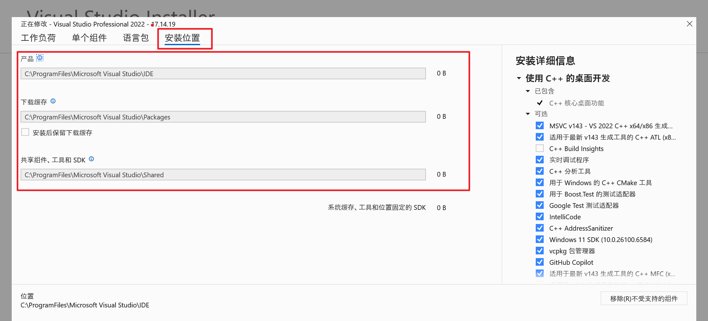
* 安装的visual studio不会自动创建桌面快捷方式，可以在搜索框中，搜索关键词：visual studio，即可看到刚刚安装的软件，将其拖到桌面即可创建快捷方式。
  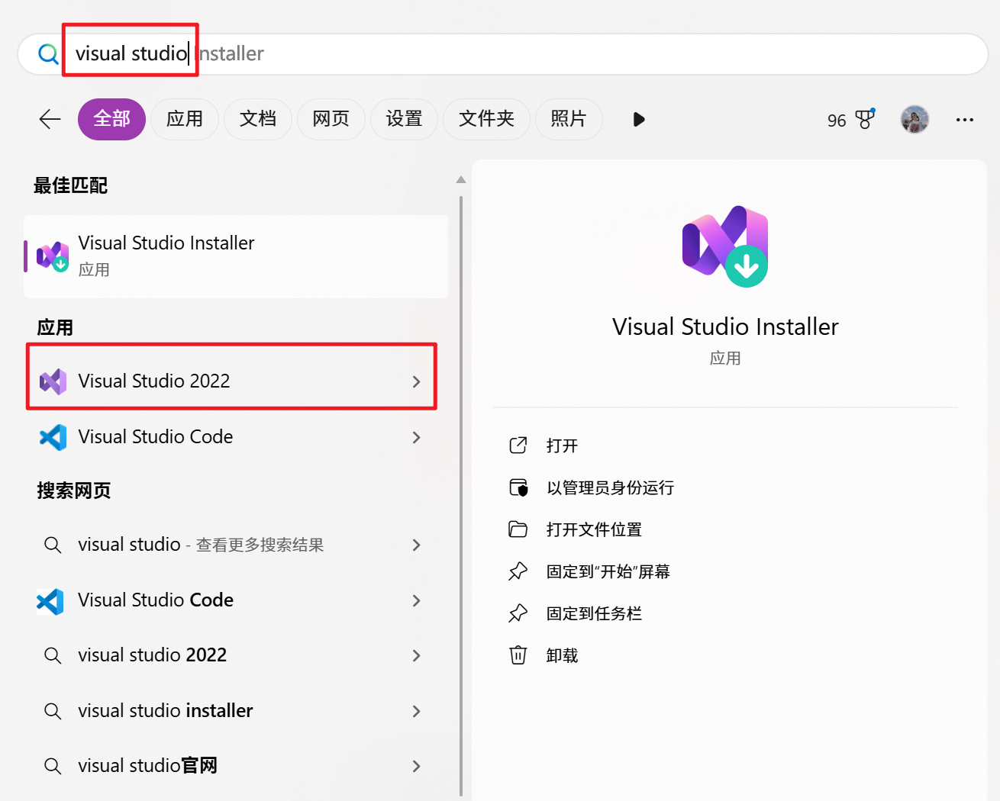

## 3. 创建最简单的C++程序

### 3.1 创建项目

* 打开刚刚安装的visual studio，点击创建新项目
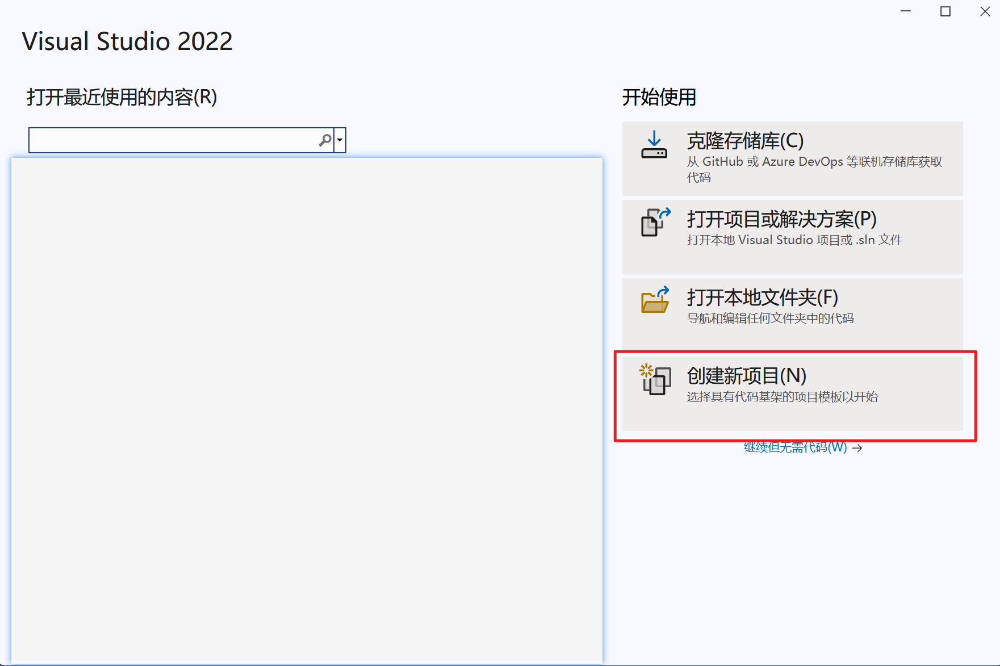
* 在项目模板中，搜索C++，选择空项目，点击右下角下一步
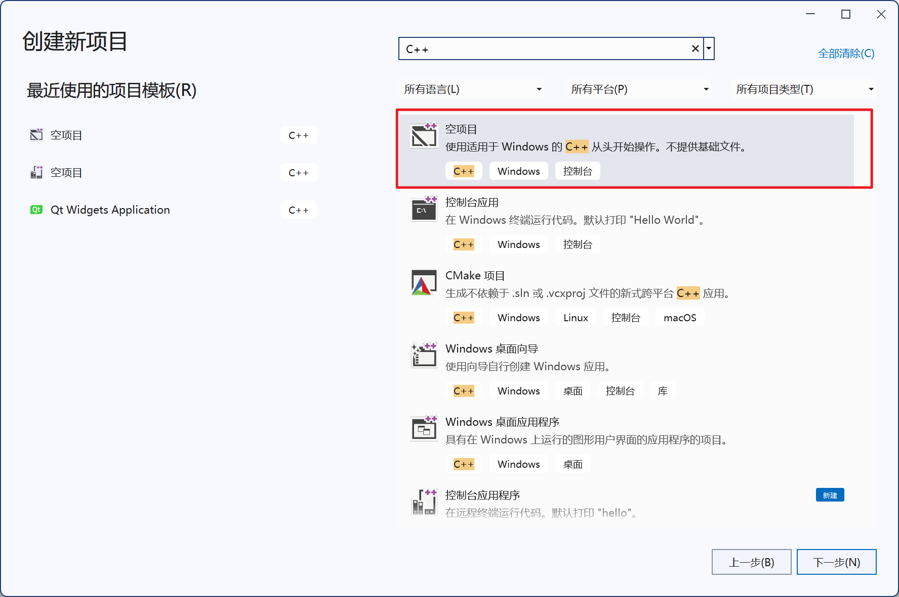
* 配置新项目：
    * 项目名称：给新项目起个名字，支持中文，但不建议用中文，不建议养成中文编码的习惯
    * 位置：选择项目和解决方案要放在哪里，支持中文，但不建议用中文，不建议养成中文编码的习惯
    * 解决方案名称：给解决方案起个名字，先可以理解为解决方案是项目的容器，一个解决方案里可以包含多个项目。VS以解决方案为单位，可以认为使用VS，必须要有一个解决方案。后续学习过程中会有所体会。同样不建议使用中文。
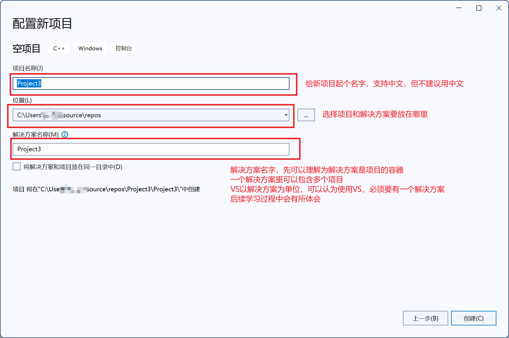
* 创建完成是这个界面
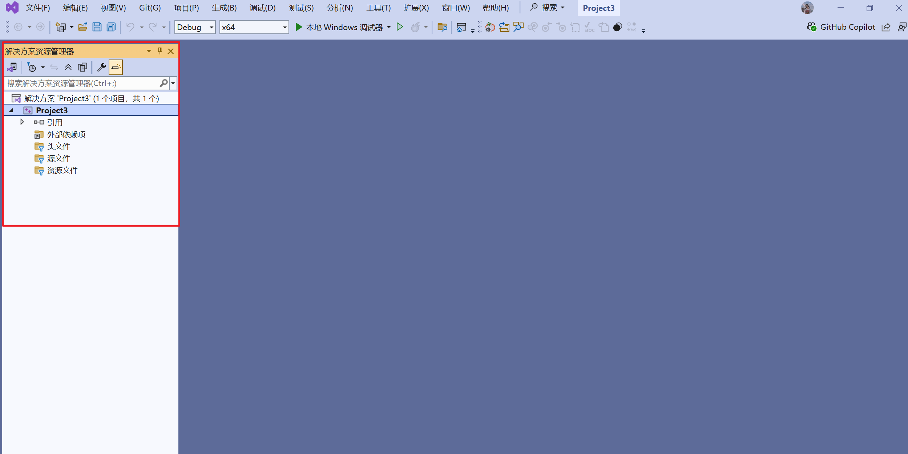
* 如果没看到解决方案资源管理器，可以在这里把它找出来
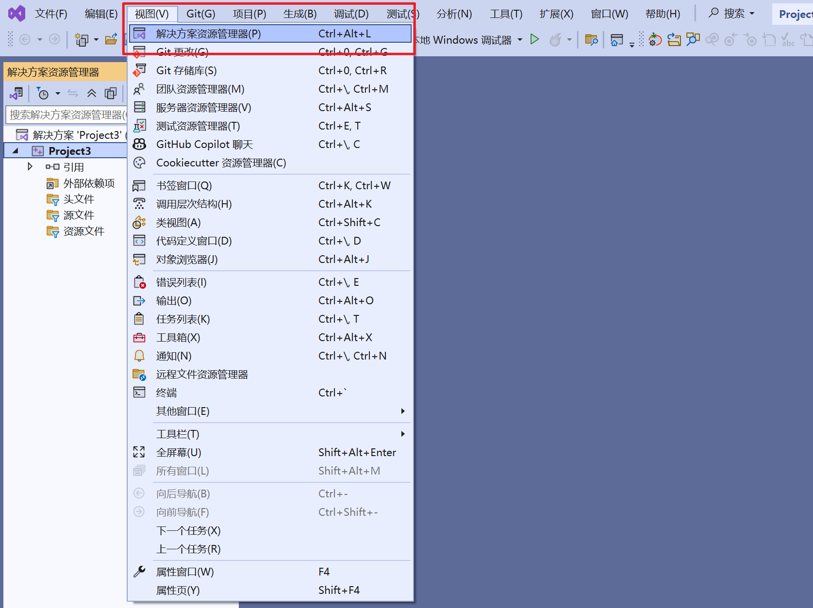
* 解决方案资源管理器窗口，可以自由拖动，个人习惯放到左边，此窗口右上角三个按钮，中间那个按钮是固定，可以将解决方案资源管理器窗口固定住。
### 3.2 新建代码文件
* 右键解决方案中的源文件，点击添加，点击新建项
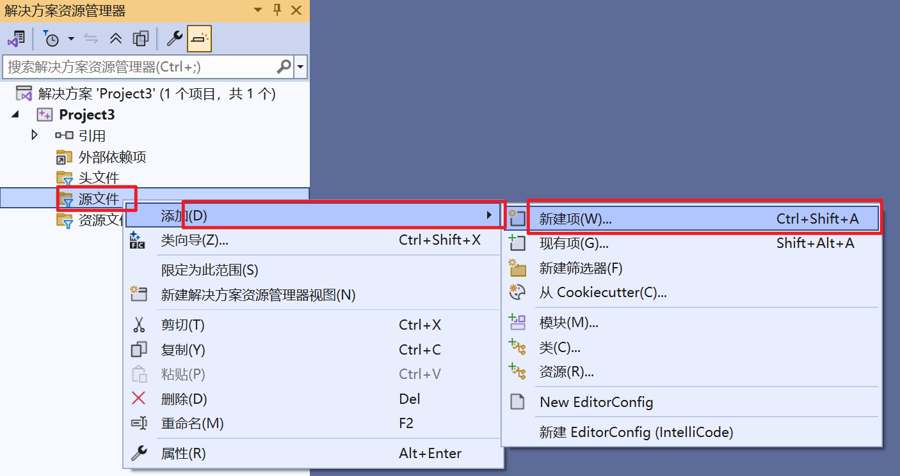
* 会弹出以下两种可能的界面，点击左下角展开所有模板，或者左下角显示紧凑视图，可以自由切换两种窗口界面
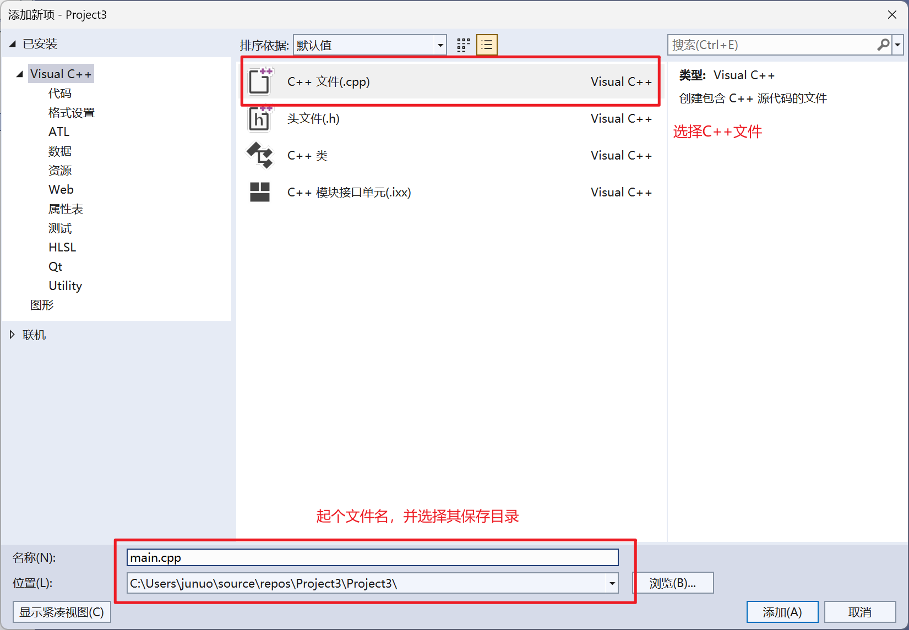

* 给新建的cpp文件起个名字，选择其保存目录，点击添加即可。
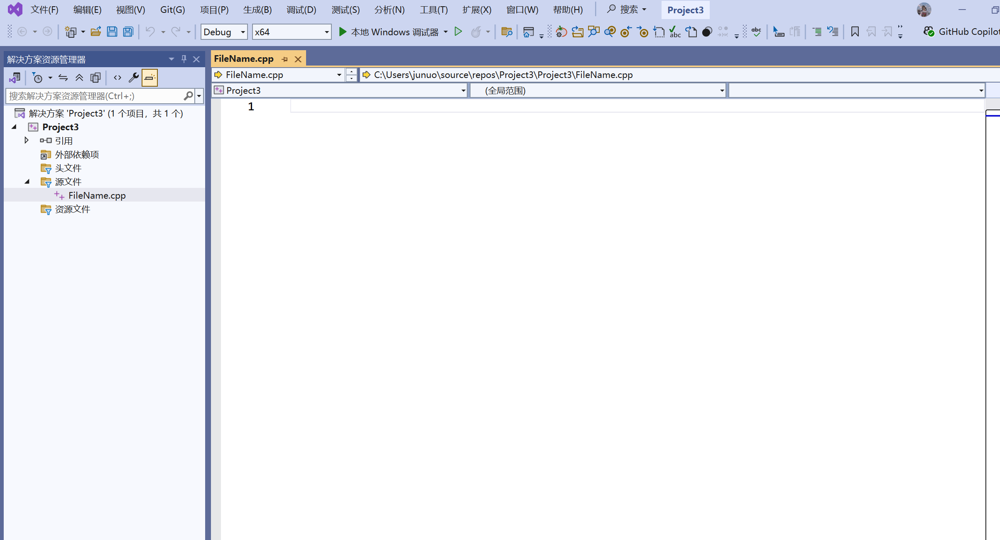
### 3.3 编写最简单的cpp代码
```c++
#include<iostream>
using namespace std;

int main()
{
	cout << "Hello world" << endl;
	system("pause");
	return 0;
}
```
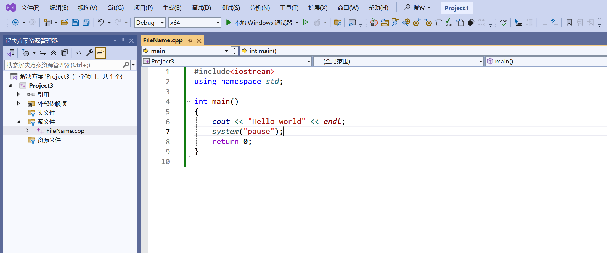
### 3.4 运行程序
* 点击上面的*本地Windows调试器*按钮，即可运行起程序
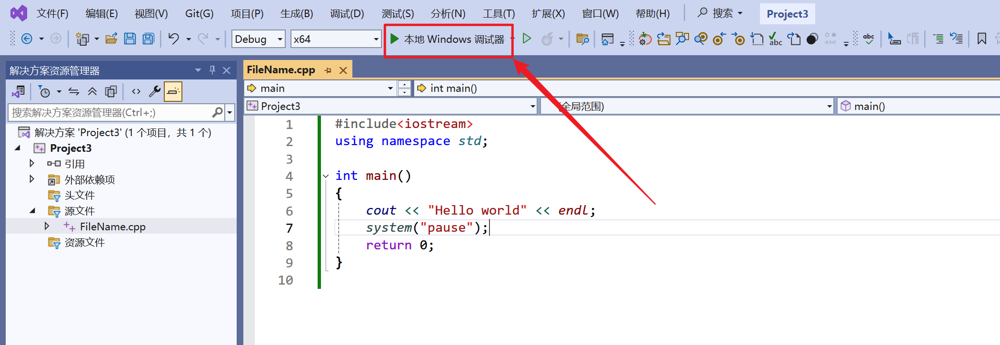
* 运行结果如下
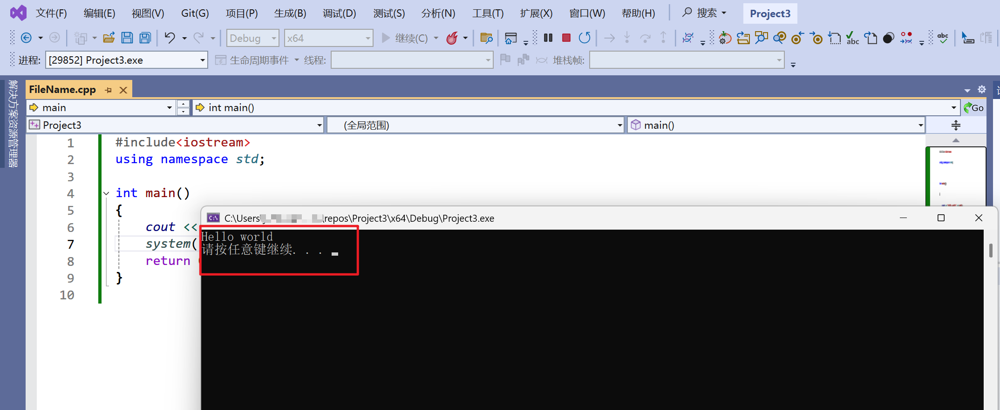

## 4. C++基本概念入门
### 4.1 代码与注释
#### 4.1.1 C++代码补充说明
* C++程序以main函数作为程序入口，所有程序都必须存在main函数
* 关于C++的详细语法，在学习过程中慢慢体会即可，入门阶段无需扣得太细致。
#### 4.1.2 注释
* 注释是指代码中存在的一些说明性文字，一般用于标记此段代码用意、有何注意事项等。
    * 作用：方便自己后续回头看这段代码，或者在团队协作中，方便其他工程师阅读自己写的代码。
    * 良好的代码，不应当写大量注释，只在代码关键且难以理解的位置写简短注释即可。
    * 如果一段代码中含有大量注释，且都是一些浅显问题，那大概率是初级程序员或者AI写的
* 注释一般有两种格式
    1.  单行注释：// 注释内容
        * 一般是写在一行代码末尾，或者一行代码上面
    2. 多行注释：/\*注释内容\*/
        * 虽然叫多行注释，但注释内容未必出现在多行
        * 通常出现在一段代码上方，对下面大段代码进行详细说明，或者就是下面这段代码的文档
```C++
#include<iostream> // 包含基本输入输出头文件
using namespace std;

/*
 这是main函数，是C++程序入口
*/
int main()
{
	cout << "Hello world" << endl; // 输出一行字
	system("pause"); /* 多行注释出现在一行也是没问题的 */
	return 0;
}
```
### 4.2 变量、常量与宏定义
#### 4.2.1 变量
* 变量是给一块内存起的名字，后续可以使用这个变量读、写这块内存
* 定义变量的语法是：`数据类型 变量名 = 初始值;`
* 举例：
```C++
#include<iostream>
using namespace std;
int main() {
	int var = 1; // 这里的int是数据类型（整型），var是变量名，1是初始值
	cout << "var = " << var << endl;
	system("pause");
	return 0;
}
```
#### 4.2.2 常量
* 常量的定义方法和变量基本相同，只是需要在前面加上const修饰
* 常量是不可更改的数据
* 举例：
```C++
#include<iostream>
using namespace std;
int main() {
	const int var = 1; // 使用const进行修饰，此时var就是常量，不可被修改
    // var = 2; // 尝试修改，会编译报错
	cout << "var = " << var << endl;
	system("pause");
	return 0;
}
```
#### 4.2.3 宏定义
* 宏定义本质是文本替换，这里先简单介绍，后续会遇到各种各样复杂的宏定义
* 本人建议非必要不使用宏定义，调试难度比较高。有的场景必须使用宏定义则再使用，比如打log输出函数名时。
* 举例：
```C++
#include<iostream>
using namespace std;
#define MAX 100
int main() {
    // 之所以说宏定义本质是文本替换，因为下面这句话在编译前的预处理阶段，就变成了这个样子：
    // cout << "MAX = " << 100 << endl;
	cout << "MAX = " << MAX << endl;
    // MAX = 200; // 同样是不可取的，预处理阶段会变成100 = 200，这显然是不可能的
	system("pause");
	return 0;
}
```
### 4.3 关键字与标识符
#### 4.3.1 关键字
* 关键字是C++语言预先保留的词。
* C++关键字节选如下：（不全）
| asm        | do           | if               | return      | typedef  |
| ---------- | ------------ | ---------------- | ----------- | -------- |
| auto       | double       | inline           | short       | typeid   |
| bool       | dynamic_cast | int              | signed      | typename |
| break      | else         | long             | sizeof      | union    |
| case       | enum         | mutable          | static      | unsigned |
| catch      | explicit     | namespace        | static_cast | using    |
| char       | export       | new              | struct      | virtual  |
| class      | extern       | operator         | switch      | void     |
| const      | false        | private          | template    | volatile |
| const_cast | float        | protected        | this        | wchar_t  |
| continue   | for          | public           | throw       | while    |
| default    | friend       | register         | true        |          |
| delete     | goto         | reinterpret_cast | try         |          |
#### 4.3.2 标识符
* 标识符是变量、常量、宏定义、函数等的名字，C++对这些进行命名时，需要遵循以下规则：
    * 标识符不能使用关键字，比如：`int if = 1;`，不可以，因为if是C++关键字，不可以被用作变量名
    * 标识符只能由字母、数字、下划线组成，且第一个字符不允许是数字，只允许是下划线或者字母
    * 标识符是大小写敏感的，严格区分大小写，比如：`int a = 1; int A = 2;`，a和A是两个完全不同、毫无关系的变量
* 标识符建议做到见名知意，不建议使用拼音，不要养成任何*中文编码*的习惯。