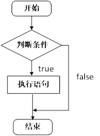
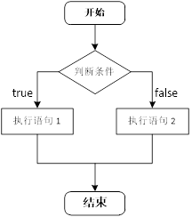
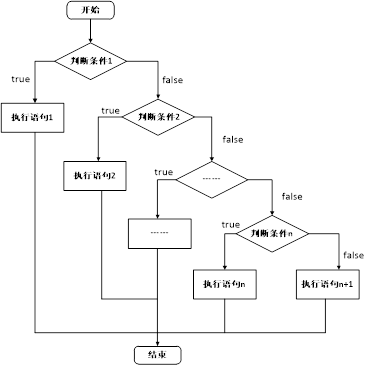
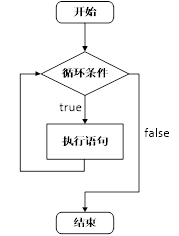
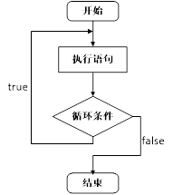
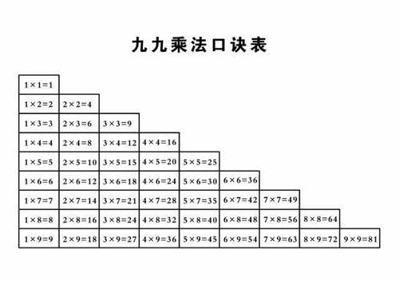

# 04_控制结构
C/C++支持最基本的三种控制结构：**顺序结构、选择结构、循环结构**
1. 顺序结构：程序按照顺序一行行从上到下执行，不发生任何跳转
2. 选择结构：根据条件是否满足，选择执行不同的代码
3. 循环结构：根据条件是否满足（循环条件），循环执行某段代码

## 4.1 选择结构
### 4.1.1 if语句
if语句用于判断一个或多个条件，执行满足条件的代码段。其有三种使用形式：
1. 单分支if语句
2. 两分支if语句
3. 多分支if语句
#### 4.1.1.1 单分支if语句
`if(条件){ 条件满足执行的语句 }`



示例代码：
```C++
#include <iostream>
using namespace std;

int main()
{
	// 选择结构-单分支if语句
	// 输入考试成绩，如果分支低于60，视为不及格，并在屏幕上输出
	int score = 0;
	cin >> score;
	cout << "score = " << score << endl;
	if (score < 60) // 注意这里末尾不要加分好，if只管紧随其后的一条代码或代码块
	{
		cout << "不及格" << endl;
	}
	system("pause");
	return 0;
}
```

#### 4.1.1.2 两分支if语句
`if(条件){ 条件满足执行的语句 }else{ 条件不满足执行的语句 };`



示例代码：
```C++
#include <iostream>
#include <ctime>
using namespace std;

int main()
{
	// 生成一个100以内的随机数，如果是偶数就去上班，如果不是偶数就睡大觉，并输出
	srand(unsigned int(time(0))); // 撒随机数种子
	int randNum = rand() % 100;
	cout << "randNum = " << randNum << endl;
	if (randNum % 2 == 0)
	{
		cout << "go to work" << endl;
	}
	else
	{
		cout << "deep sleep" << endl;
	}
	system("pause");
	return 0;
}
```

#### 4.1.1.3 多分支if语句
`if(条件1){ 条件1满足执行的语句 }else if(条件2){条件2满足执行的语句}... else{ 都不满足执行的语句}`



示例代码：
```C++
#include <iostream>
using namespace std;

int main()
{
	// 多分支if，实现分数分级输出
	// 90分及以上为A
	// 70-89为B
	// 60-69为C
	// 60以下为D
	int score = 0;
	cin >> score;
	cout << "score = " << score << endl;
	if (score >= 90)
	{
		cout << "A" << endl;
	}
	else if (score >= 70 && score < 90)
	{
		cout << "B" << endl;
	}
	else if (score >= 60 && score < 70)
	{
		cout << "C" << endl;
	}
	else
	{
		cout << "D" << endl;
	}
	system("pause");
	return 0;
}
```

#### 4.1.1.4 嵌套if语句
在if语句中，可以继续使用if语句，可以嵌套多个if语句。当然不推荐嵌套层次太深，不然读代码很费劲。

继续上面的案例，现在我们希望将等级为B的分数，再细分三等：
* 70-79为B-
* 80-84为B
* 85-89为B+

示例代码：
```C++
#include <iostream>
using namespace std;

int main()
{
	int score = 0;
	cin >> score;
	cout << "score = " << score << endl;
	if (score >= 90)
	{
		cout << "A" << endl;
	}
	else if (score >= 70 && score < 90)
	{
		if (score >= 70 && score < 80)
		{
			cout << "B-" << endl;
		}
		else if (score >= 80 && score < 85)
		{
			cout << "B" << endl;
		}
		else
		{
			cout << "B+" << endl;
		}
	}
	else if (score >= 60 && score < 70)
	{
		cout << "C" << endl;
	}
	else
	{
		cout << "D" << endl;
	}
	system("pause");
	return 0;
}
```

#### 4.1.1.5 小练习
输入三个数字，判断哪个数字最大，并输出。

### 4.1.2 三目运算符
**作用：** 通过三目运算符实现简单的判断

**语法：**`表达式1 ? 表达式2 ：表达式3`

**解释：**

如果表达式1的值为真，执行表达式2，并返回表达式2的结果；

如果表达式1的值为假，执行表达式3，并返回表达式3的结果。

** 示例代码：**
```C++
#include <iostream>
using namespace std;

int main()
{
	int a = 1, b = 2;
	int c = a > b ? a : b; // 一句话取a和b中较大的数赋值给c
	cout << "c = " << c << endl;

	(a > b ? a : b) = 100; // 三目运算符返回的是变量，可以继续赋值
	cout << "a = " << a << endl;
	cout << "b = " << b << endl;
	system("pause");
	return 0;
}
```
> 比起if语句，三目运算符在处理简单的逻辑时，更加短小简洁

### 4.1.3 switch语句
用于执行多条件分支语句

示例代码：

```C++
#include <iostream>
using namespace std;

int main()
{
	// 给领导打分，90分以上为很好，80-89为比较好，70-79为一般，低于70为差劲
	int score = 0;
	cin >> score;
	cout << "score = " << score << endl;
	switch (score / 10)
	{
	case 9:
		cout << "很好" << endl;
		break;
	case 8:
		cout << "比较好" << endl;
		break;
	case 7:
		cout << "一般" << endl;
		break;
	default:
		cout << "差劲" << endl;
		break;
	}
	system("pause");
	return 0;
}
```

注意：
* switch语句中表达式类型只能是整型或者字符型
* case里如果没有break，那么程序会一直向下执行，直到遇到第一个break或者switch语句结束

## 4.2 循环结构
### 4.2.1 while循环

满足循环条件，执行循环体（代码段）


示例代码：
```C++
int main() {
	int num = 0;
	while (num < 10)
	{
		cout << "num = " << num << endl;
		num++;
	}
	system("pause");
	return 0;
}
```
* 注意：在执行循环语句时候，程序必须提供跳出循环的出口，否则出现死循环

**小练习：猜数字**
系统随机生成一个1到100之间的数字，玩家进行猜测，如果猜错，提示玩家数字过大或过小，如果猜对恭喜玩家胜利，并且退出游戏。

### 4.2.2 do while循环
满足循环条件，执行循环体（代码段）
与while循环不同的是：
* while循环是先判断循环条件，再执行循环体，循环体可能一次都不执行
* do while是先执行一次循环体再判断循环条件，循环体至少会被执行一次



示例代码：
```C++
int main() {
	int num = 0;
	do
	{
		cout << num << endl;
		num++;
	} while (num < 10);
	system("pause");
	return 0;
}
```

**小练习：寻找水仙花数**

**需求描述：** 水仙花数是指一个 3 位数，它的每个位上的数字的 3次幂之和等于它本身

例如：1^3 + 5^3+ 3^3 = 153

请利用do...while语句，求出所有3位数中的水仙花数

### 4.2.3 for循环
满足循环条件，执行循环体（代码段）
for循环，应该是用的最多的循环语句

示例代码：
```C++
int main() {
	for (int i = 0; i < 10; i++) // 注意：要用分号进行分隔
	{
		cout << i << endl;
	}
	system("pause");
	return 0;
}
```

**小练习：敲桌子**
**需求描述：** 从1开始数到数字100， 如果数字个位含有7，或者数字十位含有7，或者该数字是7的倍数，输出敲桌子，其余数字直接输出数字。

### 4.2.4 循环嵌套
与if嵌套一样，循环语句也是支持嵌套的。
* 支持循环套循环
* 支持if套if
* 支持if套循环
* 支持循环套if
* ……

示例代码：
```C++
int main() {
	for (int i = 0; i < 10; i++)
	{
		for (int j = 0; j < 10; j++)
		{
			cout << "*" << " ";
		}
		cout << endl;
	}
	system("pause");
	return 0;
}
```

**小练习：输出乘法表**
**需求描述：** 利用嵌套循环，实现输出九九乘法表



## 4.3 跳转语句
### 4.3.1 break语句
用于跳出循环体，或者结束switch语句
* 出现在switch条件语句中，作用是终止case并跳出switch
* 出现在循环语句中，作用是跳出当前的循环语句，只能跳出当前循环，如有嵌套循环无法全部跳出

示例代码1：在switch 语句中使用break
```C++
#include <iostream>
using namespace std;

int main() {
    //1、在switch 语句中使用break
    int x = 2;
    switch (x) 
    {
        case 1:
            cout << "x = 1\n";
            break;   // 跳出 switch
        case 2:
            cout << "x = 2\n";
            break;   // 跳出 switch
        default:
            cout << "other value\n";
            break;   // 可选：跳出 switch
    }
    cout << "switch 结束后继续执行\n";
    return 0;
}
```

示例代码2：在循环语句中用break
```C++
#include <iostream>
using namespace std;

int main() {
    for (int i = 1; i <= 5; i++) {
        if (i == 3) {
            break;   // 当 i == 3 时跳出循环
        }
        cout << "i = " << i << endl;
    }
    cout << "循环结束后继续执行\n";
    return 0;
}
```

示例代码3：在嵌套循环语句中使用break，只能跳出当前循环
```C++
#include <iostream>
using namespace std;

int main() {
    for (int i = 1; i <= 3; i++) {
        cout << "外层循环 i = " << i << endl;
        for (int j = 1; j <= 3; j++) {
            if (j == 2) {
                break;   // 只跳出内层循环
            }
            cout << "  内层循环 j = " << j << endl;
        }
    }
    cout << "全部循环结束\n";
    return 0;
}
```

### 4.3.2 continue语句
用于在循环语句中，跳过本次循环中余下尚未执行的语句，继续执行下一次循环
> 注意：continue并没有使整个循环终止，只是结束本次循环，而break会跳出循环

```C++
#include <iostream>
using namespace std;

int main() {
    for (int i = 1; i <= 5; i++) {
        if (i == 3) {
            continue;   // 跳过 i == 3 这一轮
        }
        cout << "i = " << i << endl;
    }

    cout << "循环结束\n";
    return 0;
}
```

### 4.3.3 goto语句
* goto语句用于无条件跳转到程序中指定的标签位置执行代码，仅限局部跳转，不能跨函数跳转
* 在程序中不建议使用goto语句，以免造成程序流程混乱，降低代码可读性。但在某些特殊场景下，使用goto语句可以简化代码逻辑
示例代码：
```C++
#include <iostream>
using namespace std;
int main() {
    int num = 0;
    cout << "请输入一个正整数：" << endl;
    cin >> num;
    if (num < 0) {
        goto error; // 如果输入负数，跳转到error标签
    }
    cout << "你输入的正整数是：" << num << endl;
    goto end; // 跳转到end标签，结束程序
error:
    cout << "输入错误，不能是负数！" << endl;
end:
    return 0;
}
```