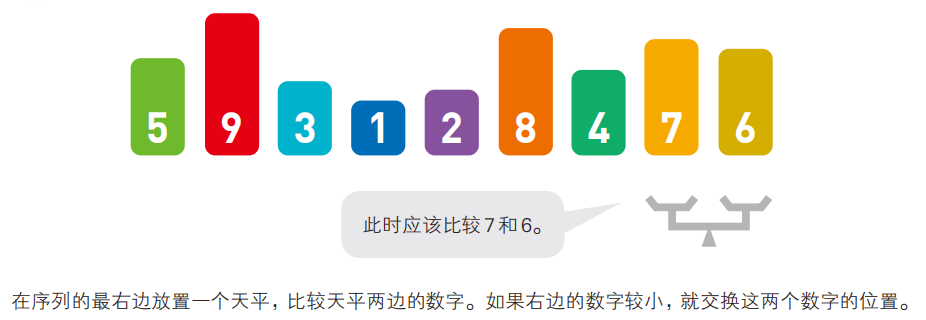

# 05_数组
## 5.1 概述
* 数组（Array）是C++中一种用于存储多个**相同类型**数据的容器。
* 它们在内存中是**连续存储**的，这使得访问数组元素非常高效。
* 数组可以是一维、二维或多维的，具体取决于应用需求。

## 5.2 一维数组
### 5.2.1 定义和初始化
一维数组有三种常见的定义和初始化方式，见示例代码：
```cpp
#include <iostream>
using namespace std;
int main() {
    // 方法一：定义时指定大小，未初始化
    int arr1[5]; // 数组名的命名规范与变量名一致
    
    // 利用下标逐个赋值
    arr1[0] = 1; // 注意：数组下标从0开始
    arr1[1] = 2;
    arr1[2] = 3;
    arr1[3] = 4;
    arr1[4] = 5;

    // 方法二：定义时指定大小并初始化
    // 如果{}中元素个数少于数组大小，剩余元素会被自动初始化为0
    int arr2[5] = {1, 2, 3, 4, 5};

    // 方法三：定义时不指定大小，由初始化列表决定大小
    int arr3[] = {10, 20, 30};

    // 输出数组元素
    for (int i = 0; i < 5; i++) {
        cout << "arr2[" << i << "] = " << arr2[i] << endl;
    }
    for (int i = 0; i < 3; i++) {
        cout << "arr3[" << i << "] = " << arr3[i] << endl;
    }

    system("pause");
    return 0;
}
```

### 5.2.2 一维数组的数组名
* 数组名代表数组的首地址，可以通过数组名访问数组元素。
* 数组名本质上是一个常量指针，不能被修改。
* 可以统计整个数组在内存中所占的字节数，使用`sizeof`运算符。

示例代码：
```cpp
#include <iostream>
using namespace std;
int main() {
    int arr[5] = {1, 2, 3, 4, 5};

    // 输出数组名（首地址）
    cout << "数组名（首地址）: " << arr << endl;
    cout << "第一个元素地址: " << &arr[0] << endl;
    cout << "第二个元素地址: " << &arr[1] << endl;

    // 计算数组所占字节数
    cout << "数组所占字节数: " << sizeof(arr) << " 字节" << endl;
    cout << "单个元素所占字节数: " << sizeof(arr[0]) << " 字节" << endl;
    cout << "数组元素个数: " << sizeof(arr) / sizeof(arr[0]) << endl;

    // 修改数组名（错误示例，编译会报错）
    // arr = arr + 1; // 错误，数组名是常量指针，不能修改

    system("pause");
    return 0;
}
```

**一维数组练习1：**
在一个数组中，存储5个整数，找出其中的最大值和最小值，并输出它们的值和位置。

**一维数组练习2：**
定义一个包含5个元素的数组，并将数组转置（即将数组的第一个元素与最后一个元素交换，第二个元素与倒数第二个元素交换，以此类推）。输出转置后的数组。
如果数组为{1, 2, 3, 4, 5}，转置后应为{5, 4, 3, 2, 1}。

### 5.2.3 冒泡排序
冒泡排序是一种简单的排序算法，通过重复遍历数组，比较相邻元素并交换它们的位置，直到整个数组有序。
1. 比较相邻的元素。如果第一个比第二个大，就交换他们两个。
2. 对每一对相邻元素做同样的工作，执行完毕后，找到第一个最大值。
3. 重复以上的步骤，每次比较次数-1，直到不需要比较



示例代码：
```cpp
#include <iostream>
using namespace std;
int main() {
    int arr[] = {64, 34, 25, 12, 22, 11, 90};
    int n = sizeof(arr) / sizeof(arr[0]);
    
    // 冒泡排序
    for (int i = 0; i < n-1; i++) {
        for (int j = 0; j < n-i-1; j++) {
            if (arr[j] > arr[j+1]) {
                // 交换
                int temp = arr[j];
                arr[j] = arr[j+1];
                arr[j+1] = temp;
            }
        }
    }

    // 输出排序后的数组
    for (int i = 0; i < n; i++) {
        cout << arr[i] << " ";
    }
    cout << endl;

    system("pause");
    return 0;
}
```

## 5.3 二维数组

二维数组就是在一维数组的基础上增加了一个维度，类似于一个表格，有行和列的概念。

### 5.3.1 定义和初始化
二维数组的定义和初始化方式如下：
```cpp
#include <iostream>
using namespace std;
int main() {
    // 方法一：定义时指定行列大小，未初始化
    int arr1[3][4]; // 3行4列

    // 利用下标逐个赋值
    arr1[0][0] = 1;
    arr1[0][1] = 2;
    arr1[0][2] = 3;
    arr1[0][3] = 4;
    // ...

    // 方法二：数据类型 数组名[行数][列数] = { {数据1，数据2 } ，{数据3，数据4 } };
    int arr2[2][3] = { {1, 2, 3}, {4, 5, 6} };

    // 方法三：数据类型 数组名[行数][列数] = { 数据1，数据2 ,数据3，数据4  };
    int arr3[2][3] = { 1, 2, 3, 4, 5, 6 };

    // 方法四：数组名[][列数] = { 数据1，数据2 ,数据3，数据4  };
    int arr4[][3] = { 1, 2, 3, 4, 5, 6 };

    // 输出二维数组元素
    for (int i = 0; i < 2; i++) {
        for (int j = 0; j < 3; j++) {
            cout << arr2[i][j] << " ";
        }
        cout << endl;
    }

    system("pause");
    return 0;
}
```

### 5.3.2 二维数组的数组名
* 二维数组名代表二维数组的首地址，可以通过数组名访问二维数组元素。
* 二维数组名本质上是一个指向一维数组的常量指针，不能被修改。
* 可以统计整个二维数组在内存中所占的字节数，使用`sizeof`运算符。

示例代码：
```cpp
#include <iostream>
using namespace std;
int main() {
    int arr[2][3] = { {1, 2, 3}, {4, 5, 6} };

    // 输出二维数组名（首地址）
    cout << "二维数组名（首地址）: " << arr << endl;
    cout << "第一行地址: " << &arr[0] << endl;
    cout << "第二行地址: " << &arr[1] << endl;
    cout << "第一个元素地址: " << &arr[0][0] << endl;
    cout << "第二个元素地址: " << &arr[0][1] << endl;

    // 计算二维数组所占字节数
    cout << "二维数组所占字节数: " << sizeof(arr) << " 字节" << endl;
    cout << "单个元素所占字节数: " << sizeof(arr[0][0]) << " 字节" << endl;
    cout << "二维数组行数: " << sizeof(arr) / sizeof(arr[0]) << endl;
    cout << "二维数组列数: " << sizeof(arr[0]) / sizeof(arr[0][0]) << endl;
    cout << "一行元素所占字节数: " << sizeof(arr[0]) << " 字节" << endl;

    // 修改二维数组名（错误示例，编译会报错）
    // arr = arr + 1; // 错误，二维数组名是常量指针，不能修改

    system("pause");
    return 0;
}
```

### 5.3.3 二维数组应用案例：矩阵相加
矩阵相加是指将两个具有相同维度的矩阵对应位置的元素相加，得到一个新的矩阵。
示例代码：
```cpp
#include <iostream>
using namespace std;
int main() {
    const int ROWS = 2;
    const int COLS = 3;

    int matrixA[ROWS][COLS] = { {1, 2, 3}, {4, 5, 6} };
    int matrixB[ROWS][COLS] = { {7, 8, 9}, {10, 11, 12} };
    int result[ROWS][COLS];

    // 矩阵相加
    for (int i = 0; i < ROWS; i++) {
        for (int j = 0; j < COLS; j++) {
            result[i][j] = matrixA[i][j] + matrixB[i][j];
        }
    }

    // 输出结果矩阵
    cout << "结果矩阵：" << endl;
    for (int i = 0; i < ROWS; i++) {
        for (int j = 0; j < COLS; j++) {
            cout << result[i][j] << " ";
        }
        cout << endl;
    }

    system("pause");
    return 0;
}
```

**二维数组练习：**
考试成绩统计：定义一个二维数组来存储5个学生的3门课程成绩，计算每个学生的总成绩和平均成绩，并输出结果。
